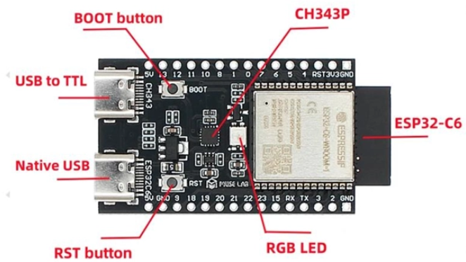
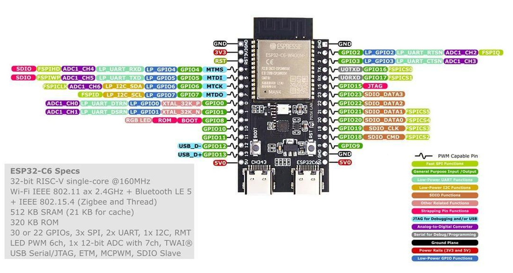
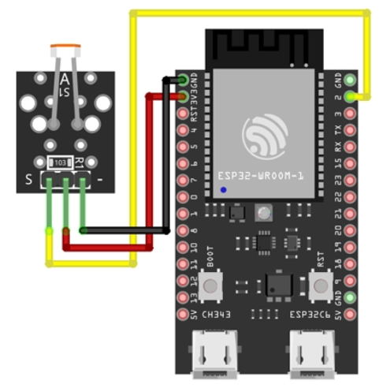

# 📂 02-sensors: ESP-IDF 기초 및 KY-018 조도 센서 제어

ESP32-C6 보드의 개발 환경(ESP-IDF) 구조를 이해하고, KY-018 CdS 조도 센서의 아날로그 신호를 ADC(Analog-to-Digital Converter)로 읽어들여 주변 밝기에 따라 내장 RGB LED의 색상을 자동으로 변경하는 스마트 조명 제어 시스템입니다.

---

##  1. 개발 환경 & 통신 방식 (ESP-IDF)

### ESP-IDF 주요 명령어
* **Build**: 작성한 C/C++ 소스 코드를 ESP32가 이해할 수 있는 바이너리 파일(`.bin`)로 컴파일
* **Flash**: 컴파일된 바이너리 파일(.bin)을 ESP32 보드의 플래시 메모리에 다운로드
* **Monitor**: 시리얼 터미널을 열어 `printf()`나 `ESP_LOGI()` 로그 메시지를 실시간 확인
* **Build, Flash and Monitor**: 빌드, 업로드, 시리얼 모니터링을 한 번에 실행
* **Full Clean**: 이전 빌드 산출물을 완전히 삭제하여 컴파일 에러 및 설정 꼬임 현상 초기화

### 보드 연결 및 통신 인터페이스
* **UART 방식 (USB to TTL / CH343P)**: 가장 보편적이고 안정적인 시리얼 통신 업로드 방식
* **JTAG 방식 (Native USB)**: 칩 내부 USB-JTAG 디버거를 이용하여 라인 단위 디버깅 및 고속 펌웨어 업로드 제공

---

## 2. ESP-IDF 프로젝트 파일 구조

```text
02-sensors/
├── CMakeLists.txt              # 프로젝트 전체를 아우르는 최상위 빌드 설정을 담은 설계도                  
├── main/
│   ├── CMakeLists.txt          # main 폴더 내 소스 코드를 빌드 대상에 포함하는 하위 설계도
│   ├── idf_component.yml       
│   └── main.c                  # 메인 C 소스 코드
└── build/                      # 빌드 수행 시 생성되는 바이너리 및 중간 컴파일 결과물 폴더
```

---

## 3. 하드웨어 스펙 및 회로 연결 

### ESP32-C6 개발 보드

* **BOOT Button**: 펌웨어 플래시 시 Connecting... 오류 발생 시 강제 다운로드 모드 진입용 버튼  
* **RST Button**: 보드 재시작(Reset) 버튼  
* **ADC Pins**: 연속적으로 변하는 아날로그 전압 신호를 12-bit 디지털 숫자로 변환 
* **Native USB**: 고급 디버깅용(내장JTAG) 
* **USB to TTL**: 일반적인업로드용-PC와연결하면‘UART 통신’으로작동(업로드용도로 쓰면됨.)
* **CH343P**: 컴퓨터의 USB 신호를시리얼(UART) 신호로 번역해주는 역할(USB to TTL 포트를 쓸때사용)

* **3V3/GND**: 센서에 전원(+극 및 -극)을 공급하는 전원 핀
* **GPIO 핀**: 개발자가 용도(입력/출력)를 직접 지정할 수 있는 일반 범용 핀 
* **ADC 핀**: 아날로그 전압 신호(조도/온습도 센서 등등)->디지털 숫자(Raw Value)로 읽어들이는 핀 
### KY-018 CdS 조도 센서 (LDR)
황화카드뮴(CdS) 소재 특성상 주변이 밝아질수록 내부 저항이 감소하여 센서 출력 전압이 낮아짐.  
* **배선 명세**:
* 센서 - (GND) -> ESP32-C6 GND 핀  
* 센서 + (VCC) -> ESP32-C6 3V3 핀  
* 센서 S (Signal) -> ESP32-C6 GPIO2 (ADC1 Channel 2) 핀
* 내장 RGB LED -> ESP32-C6 GPIO8 핀


---

## main.c 코드 로직 분석
프로그램은 초기화 단계 -> 무한 루프(while(1)) -> ADC 읽기-> 밝기 단계 판별 및 RGB 색상 적용 ->FreeRTOS 대기 순서로 동작
* 1. RGB LED 초기화 (configure_led)
* 2. ADC Oneshot 모드 설정 (app_main)
* 3. 센서 수집 및 제어 조건문 (while(1))


