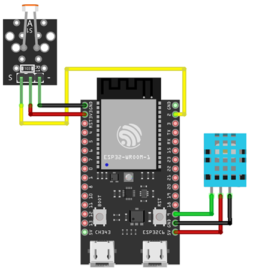

# 📂 03-actuators: DHT11 온습도 센서 & PWM 기반 RGB LED 제어

DHT11 디지털 온습도 센서와 KY-018 아날로그 조도 센서(ADC)를 동시에 운용하며, 수집된 환경 데이터의 **우선순위(Priority) 조건 제어** 및 **LEDC(PWM) 모듈**을 통한 RGB LED 제어를 다룹니다.

---

## 1. 학습 내용 & 하드웨어 특성 정리

### DHT11 온습도 센서 
* **내장 ADC 변환**: 센서 내부에 자체 Microcontroller가 포함되어 직접 아날로그 신호를 디지털로 변환함. 이에 따라 MCU(ESP32) 측의 추가 ADC 핀 할당 없이 디지털 단일선(1-Wire) 통신을 활용
* **전원 및 초기화 특성**: 동작 전압은 3.3V ~ 5.5V DC 영역을 지원함. 전원 인가 직후 최초 1초간은 내부 회로가 불안정 상태이므로 데이터 요청 명령을 송신하지 않고 대기해야 함
* **샘플링 주기 제약**: 하드웨어 동작 특성상 최소 1초 이상의 측정 간격을 유지해야 데이터 신뢰성이 확보됨 (본 실습 프로젝트에서는 2초 주기로 수집)
* **40-bit 데이터 포맷 & 빅 엔디안 (Big-Endian)**:
* 1회 데이터 Read 시 약 4ms의 통신 시간이 소요됨.
* 가장 상위 비트(MSB)부터 순서대로 수신하는 빅 엔디안 방식을 따르며, 총 40bit의 데이터를 수신함.
* 데이터 구성: 습도 정수(8bit) + 습도 소수(8bit) + 온도 정수(8bit) + 온도 소수(8bit) + Checksum(8bit)
* **체크섬(Checksum) 무결성 검증**: 
수신받은 앞선 4개 데이터(32bit)의 합과 마지막 Checksum(8bit) 값이 일치하는지 확인하여, 1bit의 오차라도 발생 시 데이터를 유효하지 않은 것으로 판단하여 파기함. 해당 비트 뱅잉 및 무결성 검증 로직 처리를 위해 외부 라이브러리 ([esp32-dht11](https://github.com/abdellah2288/esp32-dht11.git))를 연동함.

### LEDC (LED Control) Peripheral & PWM 제어
* **LEDC 모듈**: ESP-IDF에서 제어하는 하드웨어 PWM 주파수 Generator.
* **주요 설정**: 8-bit resolution (0~255 단계 Duty Cycle 제어) 및 5kHz 주파수 설정으로 RGB LED의 각 채널(R, G, B)의 밝기를 조절함.

---

## 2. 하드웨어 배선 명세

| 부품명 | 센서 핀 | ESP32-C6 연결 핀 | 기능 / 비고 |
| :--- | :--- | :--- | :--- |
| **DHT11 온습도 센서** | `Data (S)` | **GPIO 9** | 디지털 단일선 통신 (`CONFIG_DHT11_PIN`) |
| **KY-018 조도 센서** | `Signal (S)` | **GPIO 0 (ADC1_CH0)** | 아날로그 전압 측정 (`CONFIG_LDR_CHANNEL`) |
| **RGB LED (Red)** | `R` | **GPIO 3 (LEDC_CH0)** | PWM 채널 0번 제어 |
| **RGB LED (Green)** | `G` | **GPIO 4 (LEDC_CH1)** | PWM 채널 1번 제어 |
| **RGB LED (Blue)** | `B` | **GPIO 5 (LEDC_CH2)** | PWM 채널 2번 제어|
| **공통 전원** | `VCC / GND` | **3V3 / GND** | 센서 및 LED 전원 공급 |

---

## 3. 핵심 코드 흐름 및 제어 로직 

### 1️. 외부 라이브러리 연동 
ESP-IDF 기본 component 외에 외부 DHT11 라이브러리(esp32-dht11)를 사용하기 위해 main/CMakeLists.txt에 의존성을 명시함

### 2. 상태 우선순위 조건 제어 (update_led_logic)
조도센서 값은 1초간격으로 받아온다.
온습도센서 값은 2초간격으로 받아온다.
조도센서값 1,500을기준으로 밝음/어두움을판단한다.

두 개의 서로 다른 환경 데이터(온도, 조도) 수집 결과에 따라 제어 우선순위를 부여함
* 우선순위 1 (최우선): 온도가 10.0°C 이하인 경우 ->RGB Red 100% (255, 0, 0)
* 우선순위 2: 조도가 1500 미만(어두움)인 경우 -> RGB White 100% (255, 255, 255)
* 기본 상태: 조건 미충족 시 ->LED 소등 (0, 0, 0)

### 3. 비동기 주기 관리 메인 루프 (app_main)
단일 FreeRTOS Task 내에서 카운터 변수(second_counter)를 활용해 조도 측정(1초)과 온습도 측정(2초)의 주기적 스케줄링을 구현

---

## 4. 트러블슈팅 및 아키텍처 설계 결정

### 단일 테스크 구조를 유지한 이유 
* **이유**: 본 실습에서는 조도 센서와 온습도 센서 데이터 간의 우선순위 연산이 필수적이다. 태스크를 멀티태스킹 구조로 분리할 경우, 전역 변수 접근 시 레이스 컨디션이 발생하여 Mutex 등 추가 동기화 자원과 스택 메모리 오버헤드가 발생할 수 있다. 
* **결과**: `second_counter` 기반의 단일 태스크를 순차적으로 실행하는 방식으로 하여 자원 사용량을 최소화하고, 전역 변수 동기화 이슈 없이 직관적으로 LED 제어 로직을 구현하였다.