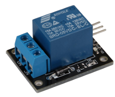
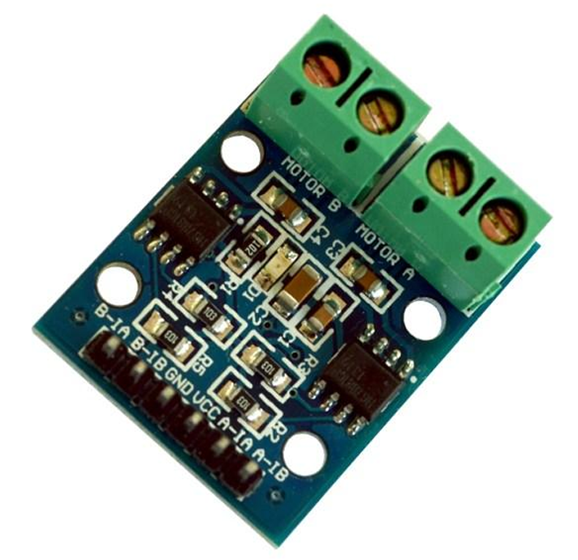
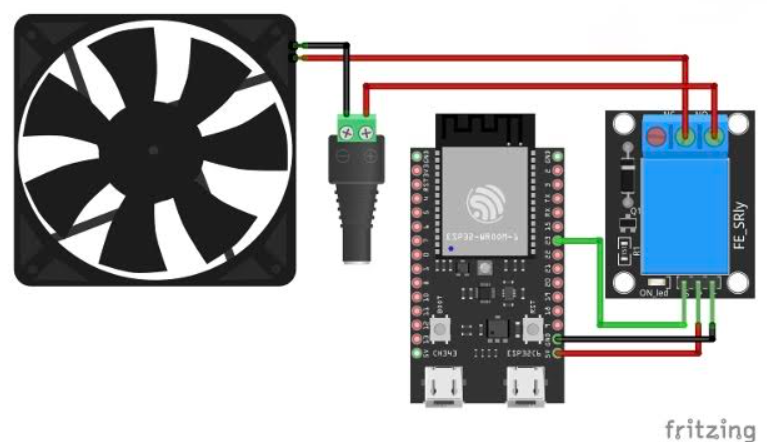

# 📂 04-motor-relay: 스마트 온실 환경 자동 제어 시스템

DHT11 디지털 온습도 센서와 KY-018 아날로그 조도 센서(ADC)에서 수집한 환경 데이터를 바탕으로 **L9110S DC 모터 드라이버(환풍기)**, **KY-019 릴레이 모듈(식물 생장등)**, **내장 WS2812B RGB LED Strip(상태 표시등)**을 조건별로 구동하는 스마트 온실 자동화 시스템 구축 

---

## 1. 학습 내용 & 액추에이터 동작 원리

### KY-019 릴레이 모듈 

* **동작 원리**: 전자석 코일을 이용한 물리적 개폐 스위치 부품으로, ESP32의 저전압(3.3V) 신호만으로 대용량/고전압(AC 220V 또는 DC 고전류) 외부 장치를 안전하게 제어가능
* **단자 구성**: COM(공통 단자), NO(Normally Open: 기본 열림/ON 시 연결), NC(Normally Closed: 기본 닫힘/ON 시 차단).
* **응용**: 조도 값 1,500 미만(어두움) 시 생장 조명을 점등하기 위해 NO 단자를 경유하여 제어함.

### L9110S 2채널 DC 모터 드라이버

* **동작 원리**: MCU의 GPIO 직접 출력으로는 DC 모터를 돌릴 수 있는 충분한 전류를 공급하지 못하기 때문에, 모터 드라이버 IC가 외부 전원의 전류를 제어하여 모터를 회전시킴.
* **제어 방식**: 2개 제어 핀(`MOTOR_PIN_A`, `MOTOR_PIN_B`)의 전위 차로 정회전 및 정지를 결정함.
  * **모터 ON (환풍기 구동)**: `MOTOR_PIN_A = HIGH (1)`, `MOTOR_PIN_B = LOW (0)`
  * **모터 OFF (환풍기 정지)**: `MOTOR_PIN_A = LOW (0)`, `MOTOR_PIN_B = LOW (0)`

### Addressable RGB LED Strip (`led_strip` RMT Peripheral)
* 일반 PWM(LEDC)과 달리 **RMT(Remote Control) 페리페럴** 기반 싱글 와이어 신호를 전달하여 1개의 GPIO 핀(GPIO 8)으로 내장 RGB LED 색상(Red/Green/White) 제어

---

## 2. 하드웨어 배선 명세 

| 부품명 | 핀 식별자 | ESP32-C6 연결 핀 | 기능 |
| :--- | :--- | :--- | :--- |
| **DHT11 온습도 센서** | `Data (S)` | **GPIO 9** | 디지털 단일선 통신 (`CONFIG_DHT11_PIN`)|
| **KY-018 조도 센서** | `Signal (S)` | **GPIO 2 (ADC1_CH2)** | 아날로그 전압 측정 (`ADC_CHANNEL_2`) |
| **L9110S 모터 드라이버** | `A-IA` / `A-IB` | **GPIO 19** / **GPIO 18** | A-IA: HIGH, A-IB: LOW 시 환풍기 모터 ON (`MOTOR_PIN_A/B`) |
| **KY-019 릴레이 모듈** | `Signal (S)` | **GPIO 23** | HIGH 신호 입력 시 생장등 릴레이 ON (`RELAY_PIN`) |
| **내장 LED Strip** | `DIN` | **GPIO 8** | RMT 통신 기반 시스템 상태 표시등 (`BLINK_GPIO`) |
| **공통 전원** | `VCC / GND` | **5V, 3V3 / GND** | 액추에이터 전원(5V) 및 센서 전원(3V3) 분리 인가 |

---

## 3. 핵심 코드 구현 및 제어 로직 

### 1. 액추에이터 GPIO 초기화 (`configure_actuators`)
모터 제어용 핀 2개와 릴레이 제어용 핀 1개를 디지털 출력 모드로 초기화

### 2. 조건별 제어 및 상태 표시 우선순위 로직 (`control_system`)
온습도 조건 및 조도 조건에 따라 물리 구동부(모터, 릴레이)를 제어하고, 내장 LED에 상태 우선순위를 부여

---

## 4. 트러블슈팅 

###  Issue 1: ESP-IDF 최신 ADC Oneshot API 적용

문제 현상: 기존 legacy API(adc1_get_raw()) 사용-> 최신 ESP-IDF 버전 환경에서 경고 및 호환성 이슈 발생 
해결: adc_oneshot_unit_handle_t 핸들을 생성하고 adc_oneshot_config_channel()을 구현하여 adc_oneshot_read() 함수로 안전하게 ADC raw 데이터를 판독하도록 함 

### Issue 2: L9110S 모터 제어 방식 선택 (Digital IO vs LEDC PWM)

고민:L9110S 모터 드라이버는 PWM을 이용한 속도 제어와 단순 GPIO Digital Output 방식 모두 가능
선택: 본 프로젝트의 환풍기는 단순 ON/OFF 구동이 목적이므로, 불필요한 PWM 타이머 자원 할당을 줄이고 직관적인 GPIO Digital High/Low 제어 방식을 채택

